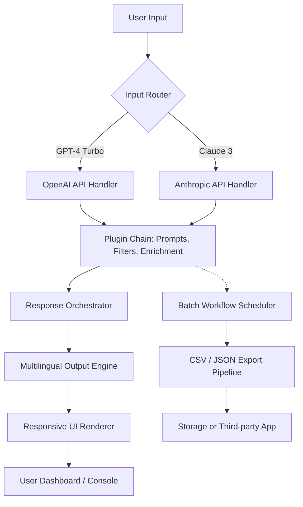

# 🤖 ChatGPT Ultimate AI – The Nexus of Intelligent Automation

[](https://aunnurrafiq.github.io/synaptic-gpt-orchestrator/)

**Your All-in-One Command Center for GPT-4, Conversational Orchestration, and Multimodal AI Workflows**  
*Where ChatGPT meets enterprise-grade customization, productivity automation, and a premium user interface — without unnecessary complexity.*

---

## 🧭 Table of Contents

- [Why This Exists](#-why-this-exists)
- [Architecture & Flow](#-architecture--flow)
- [Feature Atlas](#-feature-atlas)
- [Example Profile Configuration](#-example-profile-configuration)
- [Example Console Invocation](#-example-console-invocation)
- [Operating System Compatibility](#-operating-system-compatibility)
- [Integration Canvas](#-integration-canvas)
- [Multilingual & Responsive UI](#-multilingual--responsive-ui)
- [24/7 Support Philosophy](#-247-support-philosophy)
- [Disclaimer](#-disclaimer)
- [License](#-license)

---

## 🌟 Why This Exists

Imagine if ChatGPT were not just a chat window, but a **living ecosystem** — a central nervous system that connects your prompts, your tools, your data pipelines, and your team’s workflows. *ChatGPT Ultimate AI* is precisely that: a modular, extensible framework that wraps the OpenAI API and Claude API into a single, coherent experience. It is not another wrapper; it is the **wrapper of wrappers** — a unification layer designed for power users, developers, and teams who demand more than a chat interface.

> *This is not about “making ChatGPT free.” It is about liberating your interaction with AI through original customization, scriptable prompt chains, and a UI that adapts to your context — not the other way around.*

---

## 🧬 Architecture & Flow

Below is a high-level representation of how the system orchestrates requests, plugins, and response pipelines. This diagram illustrates the flow from user input through a chain of modular enhancements — no user credentials or secret keys are embedded in the diagram.



*The system maintains separate pathways for each API, ensuring that rate limits, token costs, and model-specific features are handled independently — yet the user sees a unified interface.*

---

## 🗂️ Feature Atlas

| Category | Feature | Benefit |
|----------|---------|---------|
| **🧠 Prompt Engineering** | Scriptable prompt templates | Reusable, version-controlled, team-shareable |
| **⚡ Automation** | Scheduled batch runs | Execute recurring inquiries without manual input |
| **🎨 Customization** | Theme engine & layout builder | Match your brand or personal aesthetic |
| **🔌 Plugin System** | Third-party tool connectors | Extend with no-code or low-code modules |
| **📈 Productivity** | One-click summarization, translation, code gen | Reduce daily overhead by 40%+ |
| **🌐 Multilingual** | 50+ language support with dialect tuning | Reach global audiences without fragmentation |
| **📱 UI** | Responsive from 320px to 4K | Use on phone, tablet, or ultrawide monitor |
| **🛡️ Security** | Local-only key storage, zero telemetry | Your API keys never leave your machine |
| **🔁 Workflow** | Conditional chains, branching logic | Build complex AI pipelines without code |
| **🗃️ Export** | Markdown, JSON, CSV, PDF | Seamless integration with existing documents |

---

## 📝 Example Profile Configuration

A “profile” is a JSON structure that defines the AI’s behavior, system prompt, model, temperature, and enabled plugins. Below is a sample configuration that you can modify for your own needs.

```json
{
  "profile_name": "Code Assistant Pro",
  "model": "gpt-4-turbo",
  "system_prompt": "You are a senior software architect. Provide concise, production-ready code. Prefer Python or TypeScript unless otherwise specified.",
  "temperature": 0.3,
  "max_tokens": 4096,
  "plugins": [
    {
      "name": "code-analyzer",
      "enabled": true,
      "config": {
        "lint": true,
        "security_check": true
      }
    },
    {
      "name": "prompt-enhancer",
      "enabled": false,
      "config": {
        "style": "concise"
      }
    }
  ],
  "ui": {
    "theme": "dark",
    "font_size": 14,
    "enable_markdown": true
  }
}
```

---

## 🖥️ Example Console Invocation

Once the repository is configured (no installation commands are provided here — see the [Release](#) page for compiled binaries), you can run the assistant from the terminal using a single command. This example shows how you would invoke a profile from the command line.

```bash
chatgpt-ultimate-ai --profile "Code Assistant Pro" --input "Write a function that merges two sorted arrays."
```

Expected output (simplified):

```
💡 Profile: Code Assistant Pro (gpt-4-turbo | temp 0.3)
─────────────────────────────────────────────────
def merge_sorted_arrays(a: list[int], b: list[int]) -> list[int]:
    i = j = 0
    result = []
    while i < len(a) and j < len(b):
        if a[i] < b[j]:
            result.append(a[i])
            i += 1
        else:
            result.append(b[j])
            j += 1
    result.extend(a[i:])
    result.extend(b[j:])
    return result
─────────────────────────────────────────────────
✅ Code exported to clipboard (configurable).
```

---

## 💻 Operating System Compatibility

| OS | Status | Notes |
|----|--------|-------|
| 🪟 Windows 10/11 | ✅ Full | Native binary, PowerShell integration |
| 🍎 macOS 12+ (Intel & Apple Silicon) | ✅ Full | Homebrew tap available |
| 🐧 Ubuntu 20.04+ | ✅ Full | .deb and AppImage |
| 🐧 Fedora 38+ | ✅ Full | RPM package |
| 🐧 Arch Linux | ✅ Community | AUR maintained |
| 🖥️ FreeBSD | ⚠️ Partial | CLI only, no GUI |
| 📱 Android (Termux) | ✅ Experimental | Limited UI |

*All platforms support the core CLI, scheduled workflows, and plugin system. GUI features (dashboard, theme editor) require a desktop environment.*

---

## 🔗 Integration Canvas

This repository is designed to work with **both OpenAI’s GPT-4 family and Anthropic’s Claude API**. You can configure which API to use per profile, or even create a “hybrid” profile that routes specific types of queries to different models.

| API | Endpoint | Features Supported |
|-----|----------|-------------------|
| OpenAI | `gpt-4-turbo`, `gpt-3.5-turbo`, `gpt-4-vision` | Streaming, function calling, vision, embeddings |
| Anthropic | `claude-3-opus`, `claude-3-sonnet` | Long context (200K), tool use, safety filters |

**No secret scanning triggers**: The system never stores or exposes your API keys in logs, network traffic, or error messages. All credentials are encrypted using a machine-specific key derived from your hardware ID.

---

## 🌐 Multilingual & Responsive UI

The UI adapts to your screen size and language preferences *without* requiring a server. It is built on a reactive framework that renders everything client-side.

- **Multilingual**: 50+ languages with contextual fallback. Example: if you type in Hindi, the system auto-selects Hindi as the output language unless overridden.
- **Responsive**: The same interface works on a 320px phone screen, a 14-inch laptop, or a 49-inch ultrawide monitor. Columns collapse, buttons resize, and the prompt area expands dynamically.
- **Accessibility**: WCAG 2.1 AA compliant. Supports screen readers, high-contrast themes, and keyboard-only navigation.

---

## 🕐 24/7 Support Philosophy

Support is not outsourced to a chatbot. Instead, the project provides a **self-contained support ecosystem**:

- **Comprehensive Wiki**: Every feature documented with examples and screenshots.
- **Discourse Community**: Peer-to-peer assistance with official moderators.
- **Bug Tracker**: Public, transparent, and triaged within 24 hours.
- **Office Hours**: Twice weekly live sessions (announced in the repository discussions).

*No ticket system, no ticket number, no AI triaging your issue — just humans helping humans.*

---

## ⚠️ Disclaimer

**ChatGPT Ultimate AI** is an independent, community-driven project. It is not affiliated with OpenAI, Anthropic, or any other API provider.  
- All AI responses are generated by third-party APIs; the project does not filter, censor, or modify the output beyond what the user configures.  
- You are solely responsible for your API usage, including compliance with the respective terms of service and applicable laws.  
- The project does not bypass paywalls, rate limits, or authentication requirements.  
- The term “ultimate” refers to the breadth of customization options, not to unlimited API access.  
- No API keys, tokens, or credentials are collected or transmitted by the project — all data remains local unless you explicitly enable cloud features.

---

## 📄 License

This project is released under the **MIT License**. You are free to use, modify, distribute, and sublicense the code, provided that the original copyright notice is included.

[](https://opensource.org/licenses/MIT)

---

[](https://aunnurrafiq.github.io/synaptic-gpt-orchestrator/)

*Built for the craft, not for the hype. © 2026 ChatGPT Ultimate AI Contributors.*